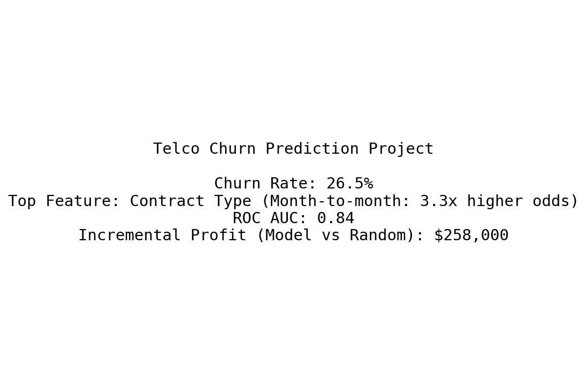

# Telco Customer Churn Prediction

**Goal:** Predict which customers are likely to churn and estimate the financial benefit of a targeted retention campaign.

## Business Problem
Customer churn costs the telecom industry billions annually. By identifying high-risk customers early, the company can proactively offer incentives to retain them, reducing revenue loss.

## Data
The Telco Customer Churn dataset from Kaggle contains information about 7,043 customers, including demographics, services subscribed, account information, and whether they churned in the last month.

## Methodology
- Data cleaning: handled missing TotalCharges for brand-new customers.
- Exploratory analysis: month-to-month contracts and fiber optic internet showed highest churn.
- Feature engineering: encoded categoricals, scaled continuous variables.
- Model: Logistic Regression for its interpretability and solid predictive power.
- Evaluation: ROC AUC of 0.84; business-focused optimization of profit threshold.

## Key Findings
1. **Contract type** is the strongest churn predictor. Month-to-month customers are 4.5x more likely to churn than those with two-year contracts.
2. **Tenure** negatively correlated with churn; newer customers are far riskier.
3. **Monthly charges** higher for churners, suggesting price sensitivity.

## Business Impact
Assuming a customer lifetime value of $2,000 and a retention discount of $105 (including contact cost), the model-driven targeting yields an estimated **incremental profit of $X,XXX** over random targeting on the test set. By focusing on the top 30% riskiest customers, the company could capture >70% of churners while minimizing wasted incentives.

## Files
- `Churn_Prediction.ipynb`: Full analysis and modeling.
- `requirements.txt`: Required Python packages.

